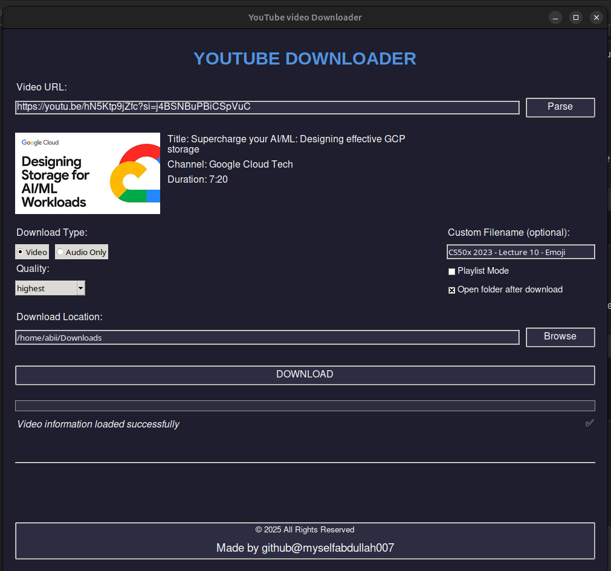

# youtube-downloader
The open-source YouTube downloader GUI you’ve been waiting for! No ads, no spyware—just pure downloading freedom. Supports proxies, subtitles, and metadata embedding.




## Features
- 🎥 Download YouTube videos in various qualities (360p to 1080p)
- 🎵 Extract audio from videos in MP3 format
- 📋 Playlist support
- 🖼️ Video thumbnail preview
- 📊 Real-time download progress
- 📁 Custom download location
- 🎯 Custom filename support
- 💫 Modern dark theme interface

## Requirements

- Python 3.7+
- Required Python packages:
  ```bash
  pip install -r requirements.txt
  ```

## Installation

1. Clone this repository:
```bash
git clone https://github.com/yourusername/youtube-downloader.git
cd youtube-downloader
```

2. Install dependencies:
```bash
pip install -r requirements.txt
```

3. Run the application:
```bash
python TEST.PY
```

## Usage

1. Launch the application
2. Paste a YouTube URL into the input field
3. Click "Parse" to load video information
4. Select your preferred options:
   - Download type (Video/Audio)
   - Quality
   - Custom filename (optional)
   - Download location
5. Click "DOWNLOAD" to start downloading

## Features in Detail

- **Video Download**: Download videos in various qualities up to 1080p
- **Audio Extraction**: Extract audio in MP3 format
- **Playlist Support**: Download entire playlists with a single click
- **Quality Selection**: Choose from multiple quality options
- **Custom Naming**: Set custom filenames for downloads
- **Progress Tracking**: Real-time progress bar with speed and ETA
- **Thumbnail Preview**: See video thumbnail before downloading
- **Modern UI**: Clean and intuitive dark-themed interface

## Dependencies

- tkinter
- pillow
- requests
- yt-dlp


## License

This project is licensed under the MIT License - see the [LICENSE](LICENSE) file for details.

## Acknowledgments

- [yt-dlp](https://github.com/yt-dlp/yt-dlp) for the core downloading functionality

## Support

If you encounter any issues or have suggestions, please open an issue in the GitHub repository.

## Author

GitHub: [@myselfabdullah007](https://github.com/myselfabdullah007)

---
